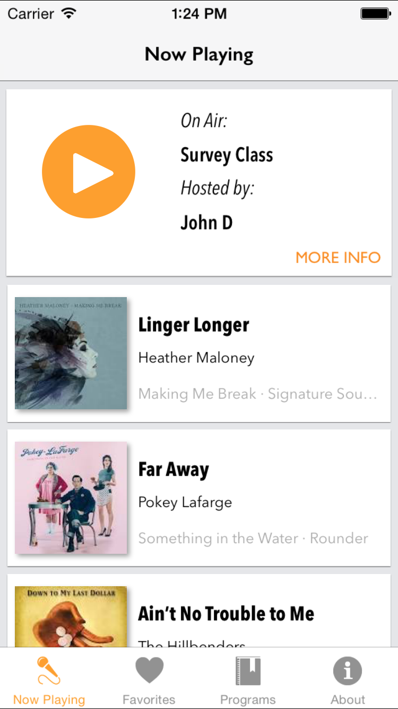
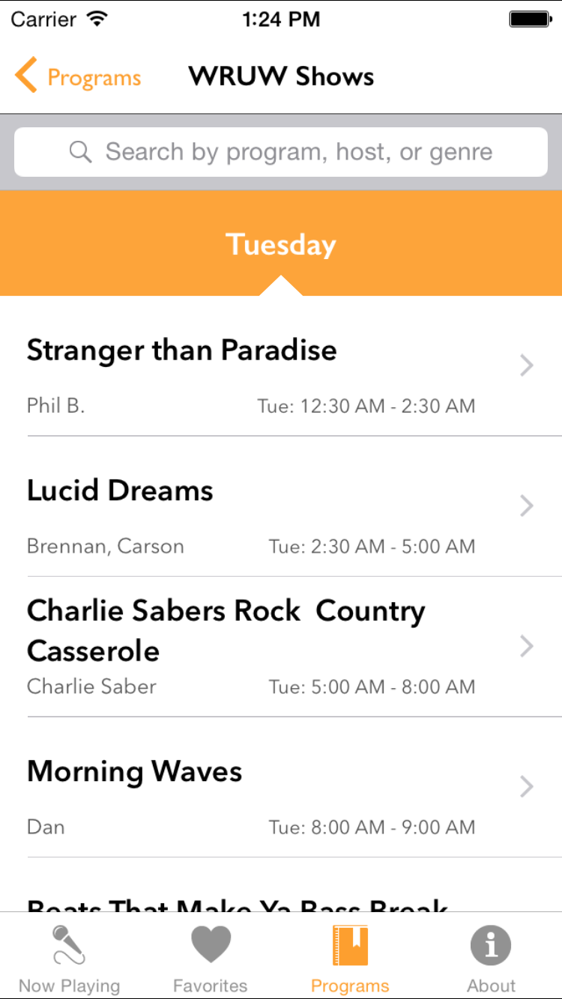

# WRUW iPhone App

* Created by "Nick Jordan" <nkj7@case.edu>

This is the official iPhone app for [WRUW](http://www.wruw.org), the student-operated radio station at Case Western Reserve University.  WRUW plays "More Music, Fewer Hits".

The purpose of this app is to increase the global reach of listeners, as well as improve the listening experience for all listeners.  Users will be able to listen to the live stream, look at all program archives, and keep track of their favorite songs and programs.  

The app is not currently on the App Store, but it is being prepped for rerelease

## TO-DO
- [x] Update networking layer, config with new API
- [ ] Fix bugs that cropped up from OS/Pods update
- [ ] Convert Models to Swift
- [ ] Convert View Controllers to Swift
- [ ] Add tests & MVVM architecture
- [ ] Implement streams of previous archives

#### Screenshots

&nbsp;&nbsp;&nbsp;&nbsp;&nbsp;&nbsp;&nbsp;&nbsp;&nbsp;&nbsp;

